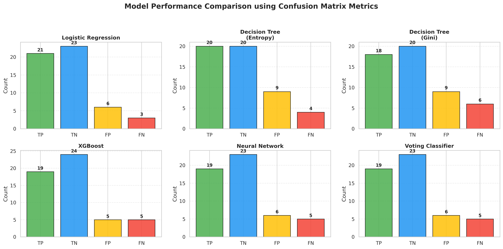
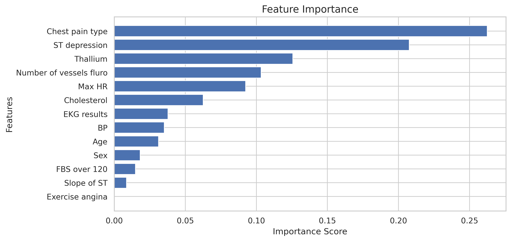

# ❤️ Heart Disease Prediction using Machine Learning

---

## 📌 Table of Contents
- [Overview](#-overview)
- [Dataset](#-dataset)
- [Tech Stack](#-tech-stack)
- [Project Workflow](#-project-workflow)
- [Models Used](#-models-used)
- [Results](#-results)
- [Visualizations](#-visualizations)
- [Key Insights](#-key-insights)
- [How to Run](#-how-to-run)
- [Conclusion](#-conclusion)
- [Author](#-author)

---

## 📖 Overview

This project predicts the presence of heart disease using patient clinical data and machine learning models.

It covers:
- Data preprocessing & cleaning  
- Exploratory Data Analysis (EDA)  
- Statistical testing (Chi-Square)  
- Feature scaling  
- Model building & evaluation  
- Model comparison  

---

## 📊 Dataset

The dataset contains medical attributes such as:

- Age  
- Sex  
- Chest Pain Type  
- Blood Pressure  
- Cholesterol  
- FBS over 120  
- EKG Results  
- Max Heart Rate  
- Exercise Angina  
- ST Depression  
- Slope of ST  
- Number of Vessels Fluro  
- Thallium  

🎯 **Target Variable:**  
- `Presence = 1`  
- `Absence = 0`

---

## 🛠️ Tech Stack

- Python  
- Pandas, NumPy  
- Matplotlib, Seaborn  
- Scikit-learn  
- XGBoost  
- TensorFlow / Keras  
- Sweetviz  
- YData Profiling  
- SciPy  

---

## ⚙️ Project Workflow

1. Data Loading & Inspection  
2. Data Cleaning & Preprocessing  
3. Outlier Detection (IQR Method)  
4. Exploratory Data Analysis  
5. Statistical Testing (Chi-Square)  
6. Train-Test Split  
7. Feature Scaling (StandardScaler)  
8. Model Training  
9. Model Evaluation  
10. Feature Importance Analysis  

---

## 🤖 Models Used

- Logistic Regression  
- Decision Tree (Entropy)  
- Decision Tree (Gini)  
- XGBoost Classifier  
- Neural Network  
- Voting Classifier  

---

## 📈 Results

| Model | Performance |
|------|------------|
| Logistic Regression | Good baseline |
| Decision Tree | Interpretable |
| XGBoost | High performance |
| Neural Network | Strong non-linear modeling |
| Voting Classifier | Balanced results |

---

## 📊 Visualizations

## 📊 Model Comparison

---

## 📊 Feature Importance

---

## 🔍 Key Insights

- Cholesterol and Thallium show strong correlation with heart disease  
- Feature scaling improves model performance  
- XGBoost and Neural Networks perform better for complex patterns  
- Chi-Square test confirms important feature relationships  

---

