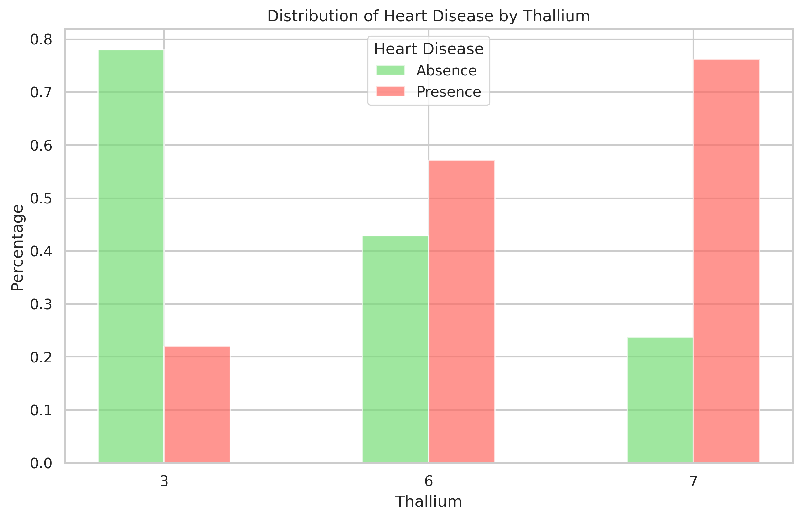

# ❤️ Heart Disease Prediction using Machine Learning

---

This project predicts heart disease using machine learning models by analyzing patient clinical data. It includes exploratory data analysis, feature importance evaluation, and comparison of models such as logistic regression, decision trees, and XGBoost.

---

## 📌 Table of Contents
- [Overview](#-overview)
- [Dataset](#-dataset)
- [Tech Stack](#-tech-stack)
- [Project Workflow](#-project-workflow)
- [Models Used](#-models-used)
- [Results](#-results)
- [Visualizations](#-visualizations)
- [Key Insights](#-key-insights)
- [How to Run](#-how-to-run)
- [Conclusion](#-conclusion)
- [Author](#-author)

---

## 📖 Overview

This project predicts the presence of heart disease using patient clinical data and machine learning models.

It covers:
- Data preprocessing & cleaning  
- Exploratory Data Analysis (EDA)  
- Statistical testing (Chi-Square)  
- Feature scaling  
- Model building & evaluation  
- Model comparison  

---

## 📊 Dataset

The dataset contains medical attributes such as:

- Age  
- Sex  
- Chest Pain Type  
- Blood Pressure  
- Cholesterol  
- FBS over 120  
- EKG Results  
- Max Heart Rate  
- Exercise Angina  
- ST Depression  
- Slope of ST  
- Number of Vessels Fluro  
- Thallium  

🎯 **Target Variable:**  
- `Presence = 1`  
- `Absence = 0`

---

## 🛠️ Tech Stack

- Python  
- Pandas, NumPy  
- Matplotlib, Seaborn  
- Scikit-learn  
- XGBoost  
- TensorFlow / Keras  
- Sweetviz  
- YData Profiling  
- SciPy  

---

## ⚙️ Project Workflow

1. Data Loading & Inspection  
2. Data Cleaning & Preprocessing  
3. Outlier Detection (IQR Method)  
4. Exploratory Data Analysis  
5. Statistical Testing (Chi-Square)  
6. Train-Test Split  
7. Feature Scaling (StandardScaler)  
8. Model Training  
9. Model Evaluation  
10. Feature Importance Analysis  

---

## 🤖 Models Used

- Logistic Regression  
- Decision Tree (Entropy)  
- Decision Tree (Gini)  
- XGBoost Classifier  
- Neural Network  
- Voting Classifier  

---

## 📈 Results

| Model | Performance |
|------|------------|
| Logistic Regression | Good baseline |
| Decision Tree | Interpretable |
| XGBoost | High performance |
| Neural Network | Strong non-linear modeling |
| Voting Classifier | Balanced results |

---

## 📊 Exploratory Data Analysis (EDA)

To understand the dataset and uncover patterns, extensive exploratory data analysis was performed.

### 🔍 Key Steps

- Checked dataset shape, data types, and unique values  
- Identified missing values and duplicates  
- Converted categorical variables into numerical format  
- Detected and removed outliers using IQR method  
- Generated automated reports using Sweetviz and YData Profiling  
- Visualized feature relationships and distributions  

---

### 📈 Key Visualizations

#### 🔹 Model Performance Comparison

This visualization compares different machine learning models using confusion matrix metrics (TP, TN, FP, FN), helping evaluate model effectiveness.

---

#### 🔹 Feature Importance

This plot shows the most influential features in predicting heart disease based on a Decision Tree model.

---

#### 🔹 Thallium vs Heart Disease

This visualization shows the distribution of heart disease across different Thallium values, highlighting its strong relationship with the target variable.

---

### 🧠 Key Insights 

- Cholesterol and Thallium show strong influence on heart disease prediction  
- Feature scaling significantly improves model performance  
- Outlier removal improves model stability  
- XGBoost provides the best overall performance among models  
- False negatives are critical and must be minimized in healthcare predictions
- Chi-Square test confirms important feature relationships 

---

---

